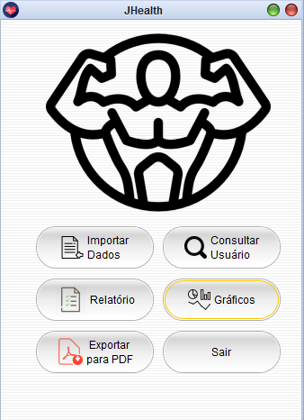
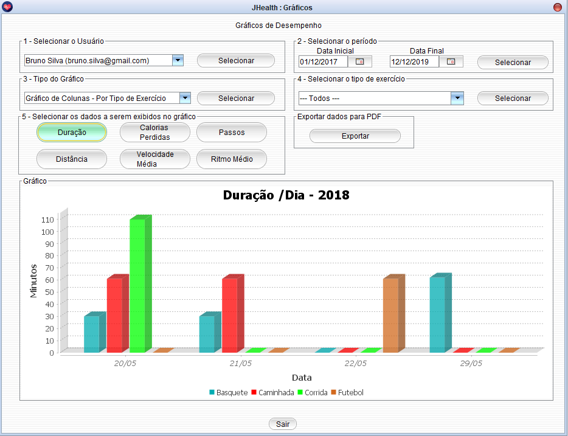
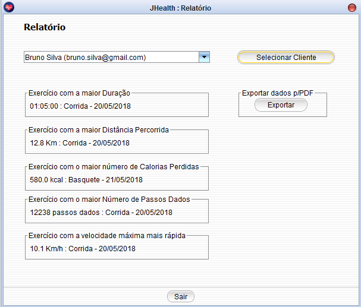
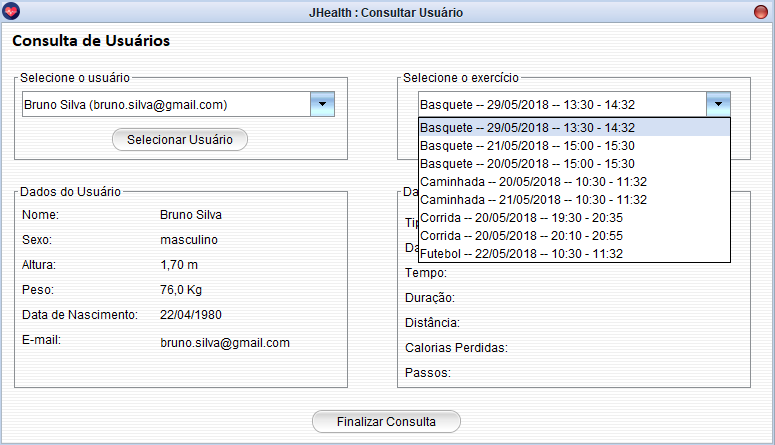

# JHealth

Projeto desenvolvido para a disciplina de Tecnologia de Orientação à Objetos, do curso de Sistemas para Internet do IF Sudeste MG - *Campus* Barbacena, 2018. 

    

O objetivo da aplicação é apresentar relatórios sobre atividades realizadas no aplicativo Samsung Health e armazenadas em arquivos texto.

    

    

    

A aplicação foi desenvolvida utilizando a linguagem Java e o paradigma de Programação Orientada à Objetos.